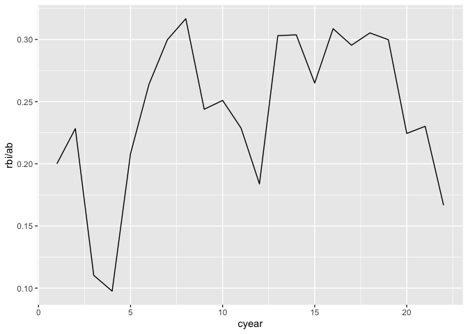
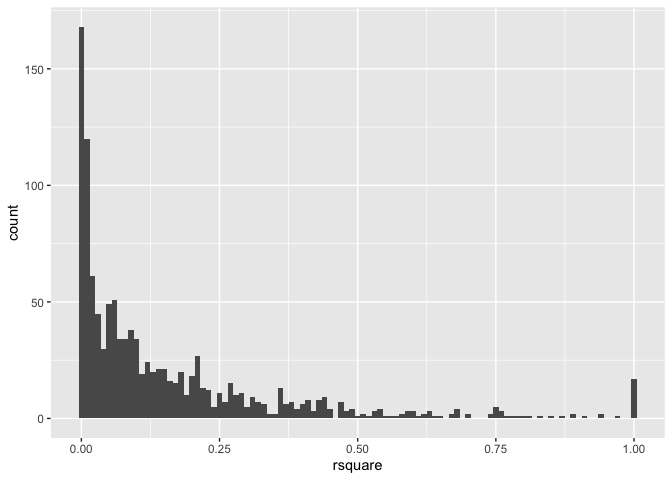

The Split-Apply-Combine Strategy for Data Analysis
================
Kundan Kumar
2022-02-16

<!-- README.md is generated from README.Rmd. Please edit that file -->

## Prompt:

The `plyr` package has by now been replaced by other, even faster
packages, but the idea of *Split, apply, combine* is as relevant as
ever.

Read the paper [The Split-Apply-Combine Strategy for Data
Analysis](https://www.jstatsoft.org/article/view/v040i01) by Hadley
Wickham.

Write a blog post addressing the following questions:

1.  The R code for the split-apply-combine paper is posted with the
    paper. Pick one of the examples demonstrating `plyr` functionality
    (such as `dlply` or `ddply`, …) and rewrite the example using
    functionality from the package `dplyr`. Make sure that your example
    works and the results are identical.

**Solution:** The author talks about the split-combine strategy for data
analysis. This concept is similar to map -reduce technique for
processing huge datasets. Split and apply is similar to map in which
data is divided in the some with some criteria, while combine correspond
to reduce combination of all datasets results into similar data
structure and finally summarized the overall results.

The detailed r code for ‘dplyr’ package as below

``` r
library(dplyr)
#> 
#> Attaching package: 'dplyr'
#> The following objects are masked from 'package:stats':
#> 
#>     filter, lag
#> The following objects are masked from 'package:base':
#> 
#>     intersect, setdiff, setequal, union
library(plyr)
#> ------------------------------------------------------------------------------
#> You have loaded plyr after dplyr - this is likely to cause problems.
#> If you need functions from both plyr and dplyr, please load plyr first, then dplyr:
#> library(plyr); library(dplyr)
#> ------------------------------------------------------------------------------
#> 
#> Attaching package: 'plyr'
#> The following objects are masked from 'package:dplyr':
#> 
#>     arrange, count, desc, failwith, id, mutate, rename, summarise,
#>     summarize
library(Lahman)
library(purrr)
#> 
#> Attaching package: 'purrr'
#> The following object is masked from 'package:plyr':
#> 
#>     compact
library(broom)
library(ggplot2)

data("baseball",package = "plyr")
 
# Now Base ball case study
head(baseball)
#>            id year stint team lg  g  ab  r  h X2b X3b hr rbi sb cs bb so ibb
#> 4   ansonca01 1871     1  RC1    25 120 29 39  11   3  0  16  6  2  2  1  NA
#> 44  forceda01 1871     1  WS3    32 162 45 45   9   4  0  29  8  0  4  0  NA
#> 68  mathebo01 1871     1  FW1    19  89 15 24   3   1  0  10  2  1  2  0  NA
#> 99  startjo01 1871     1  NY2    33 161 35 58   5   1  1  34  4  2  3  0  NA
#> 102 suttoez01 1871     1  CL1    29 128 35 45   3   7  3  23  3  1  1  0  NA
#> 106 whitede01 1871     1  CL1    29 146 40 47   6   5  1  21  2  2  4  1  NA
#>     hbp sh sf gidp
#> 4    NA NA NA   NA
#> 44   NA NA NA   NA
#> 68   NA NA NA   NA
#> 99   NA NA NA   NA
#> 102  NA NA NA   NA
#> 106  NA NA NA   NA
```

``` r
# Summaries
summarise(baseball,nteam=length(unique(team)))
#>   nteam
#> 1   132
summarise(baseball,nplayers=length(unique(id)))
#>   nplayers
#> 1     1228
```

``` r
# mutate and filter
baberuth <- filter(baseball, id == "ruthba01") %>%
  mutate(cyear = year - min(year) + 1)
 
# plot line graph
ggplot(baberuth, aes(x = cyear, y = rbi / ab)) +
  geom_line()
```

<!-- -->

``` r
# Filter based on condition
baseball <- baseball %>%
  filter(ab >= 25)
 
# Adding cyear 
baseball <- baseball %>%
  group_by(id) %>%
  mutate(cyear = year - min(year) + 1) %>%
  ungroup()
 
# fitting a Model 
model <- function(df) {
  coef_df <- as.data.frame(t(coef(lm(rbi / ab ~ cyear, data = df))))
  names(coef_df) <- c("intercept", "slope")
  rsq <- summary(lm(rbi / ab ~ cyear, data = df))$r.squared
  coef_df$rsquare <- rsq
  return(coef_df)
}
bmodels <- baseball %>%
  group_by(id) %>%
  do(model(.))
 
bcoefs <- bind_rows(bmodels)
 
baseballcoef <- left_join(baseball, bcoefs, by = "id")
 
# R-squared
subset(baseballcoef, rsquare > 0.999)$id
#>  [1] "lindbpa01" "carrocl02" "lindbpa01" "carrocl02" "jacksgr01" "jacksgr01"
#>  [7] "splitpa01" "woodwi01"  "splitpa01" "woodwi01"  "bannifl01" "bannifl01"
#> [13] "bedrost01" "davisma01" "penaal01"  "davisma01" "penaal01"  "bedrost01"
#> [19] "powerte01" "cookde01"  "powerte01" "cookde01"  "violafr01" "violafr01"
#> [25] "wakefti01" "wakefti01" "weathda01" "weathda01" "burbada01" "burbada01"
#> [31] "oliveda02" "oliveda02"
 
# histogram  R-squared
ggplot(bcoefs, aes(x = rsquare)) +
  geom_histogram(binwidth = 0.01)
#> Warning: Removed 1 rows containing non-finite values (`stat_bin()`).
```

<!-- -->

2.  Which (base R) functions do you know that support the
    split-apply-combine strategy? In your opinion, are these sufficient?
    State why or why not?

**Solution:** The base R functions which supports split-apply-combine.

- **split()** : This function splits data frame into groups based on the
  certain criteria.

- **apply()** : This functions applies to rows/columns of a matrices or
  array.These are few apply functions.

  - **tapply()** : It applies to subsets of a vector defined by one or
    more factors.
  - **sapply()** : It applies to each element of a list or vector and
    simplifies the results into a vector or matrix.
  - **lapply()** : It applies to each element of a list and returns a
    list of the same length.

- **aggregate()** : This functions is used to group data by one or more
  variables. It is used to combine the results into a new data frame.

These functions are not sufficient to split-apply-combine strategy.These
base R function that supports the split-apply-combine strategy. These
base function has limited functionality and cannot be sufficient
functionality to accomplish complex data manipulation. For
e.g. aggregate() splits a data frame into subsets based on criteria and
also used to compute a summary statistic. This is good for simpler
tasks. It is not best option for more complex tasks, which requires
several steps/loops and also cannot handle missing data very well, thus
lead to inefficient for large data-sets.

So, R packages like dplyr, plyr etc provides flexible and efficient
packaging for complex grouping, filtering and summarizing. These
packages provides efficient and optimized code for working with large
data-sets.

3.  The ChatGPT response to the prompt “Describe the split-apply-combine
    paradigm” is given below. Generally, the chatbot’s answers are
    decent. ChatGPT does have problems getting details right. Which
    details would you change in the response?

> The “split-apply-combine” paradigm is a data analysis strategy used in
> statistics and data science to analyze grouped data. It consists of
> three steps:
>
> Split: The data is first split into groups based on one or more
> variables of interest.
>
> Apply: A specific operation or function is applied to each group of
> data, usually for the purpose of aggregating, summarizing, or
> transforming the data within each group.
>
> Combine: The results of the operation applied to each group are then
> combined and returned as a single output.
>
> The split-apply-combine paradigm is particularly useful in cases where
> the data cannot be analyzed as a whole and instead must be analyzed in
> smaller, more manageable chunks. This allows for more efficient data
> processing and improved scalability. The paradigm is commonly
> implemented using tools such as the “groupby” function in the R and
> Python programming languages, and the “dplyr” library in R.

**Solution:**

The ChatGPT response are very basic, it didn’t have explain these three
terms very well and which functions requires to perform this tasks. It
can be explained better. One examples is:

- **Split:** It divides the data into groups based on or more
  criteria/variables. This can be achieved by split() function or group
  by function.

- **Apply:** This operation applies to each group of data separately
  which is used for aggregating, transforming and summarizing the data
  within each group. It can be done by lapply, tapply, or summarize
  functions.

- **Combine:** This operations applies to each group combined and return
  a single output .This can be done by functions like rbind,
  cbind,aggregate, or bind_rows.

In general, More detailed explanation will be helpful to understand the
concepts. Moreover, Providing few examples of specific functions can be
used for each step of the split-apply-combine paradigm will be really
helpful.

------------------------------------------------------------------------

You can write your answers directly the `README.Rmd` file. Make sure
that the file knits (you will need to activate any packages your use in
your code chunks with a call to `library(xxx)`, where xxx is the name of
the package, such as `plyr` ). Commit your changes and push to your
repo; add any files in the `README_files` directory to your repository.
