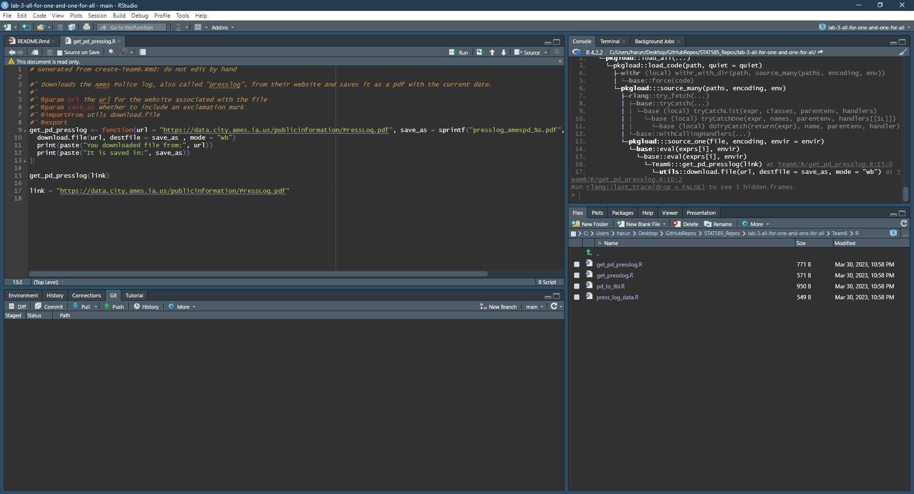
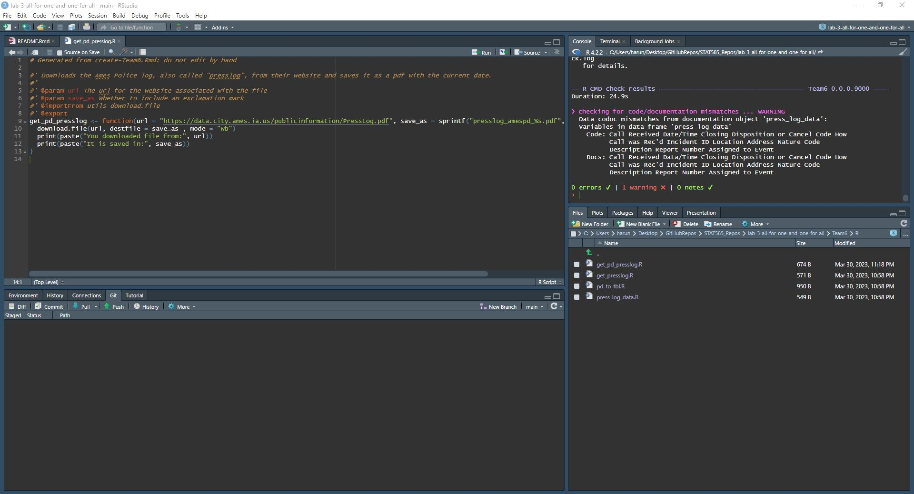

Undefined Object Error
================
Harun Celik
2023-03-30

<!-- README.md is generated from README.Rmd. Please edit that file -->
<!-- badges: start -->

<!-- badges: end -->

## Prompt:

Fix one of the problems in one of our community packages at
`https://github.com/Stat585-at-ISU/lab-3-all-all-for-one-and-one-for-all`,
and write about it.

## Instructions:

What we want to know is the **exact** warning or error message of the
item you fixed, and a description of what you did, also as specific as
possible.

My search for an error was to try and load all of the packages to then
run checks on them to see which ones I could immediately jump into. I
definitely didn’t go in numerical order but I did find that I got an
error after trying `devtools::load_all("Team6/")`. The exact message can
be seen from the screenshot below.

I could see from the console that the error was in the
`get_pd_presslog()` function of the package. Running
`rlang::last_trace()` and opening up the `get_pd_presslog()` function
document I found the following.

The Traceback mentioned that the error was in an object called “link”.
Checking the function file, I found that there was an instance where the
function was called with a variable called “link” which was supposed to
supply the `{url}` argument to the function.

The first problem is that the variable “link” is assigned after the
function is called so `download.file()` doesn’t have a `{url}` argument
supplied to it. This causes the function to fail and therefore
`load_all()` fails to run.

The second problem is that there is no need to call the
`get_pd_presslog()` function in the function documentation. That is
better reserved for a testing environment set up with
`usethis::use_testthat()`.

My goal was only to have the package load properly so removing those two
lines allowed me to load the package and run a `devtools::check()`
without any problems. Here are the results.

